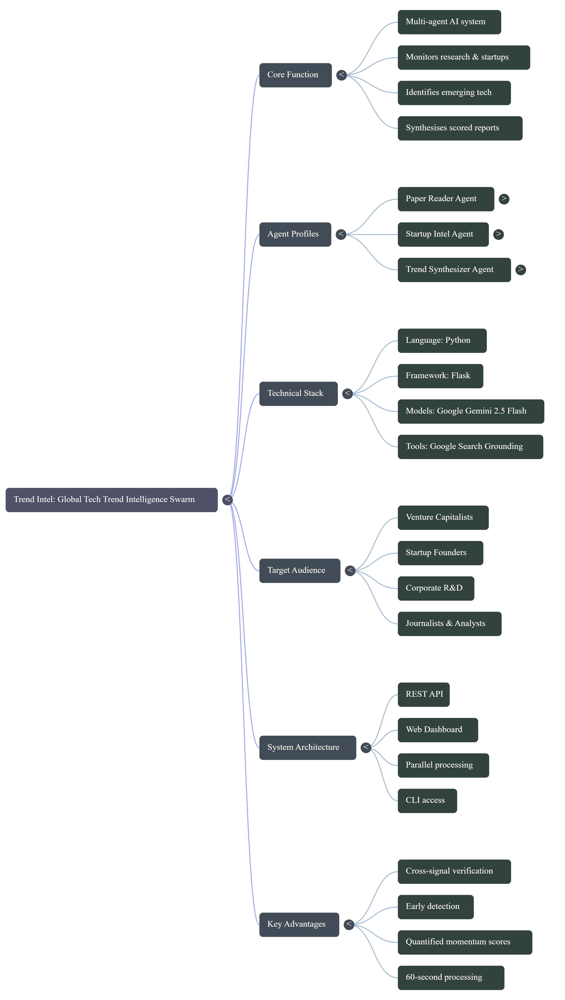

# 🌐 Trend Intel

> A multi-agent AI system that monitors research publications and startup activity simultaneously to surface emerging technologies before they hit mainstream news.

[](https://tech-swarm-92292966265.us-central1.run.app/)
---

## 📌 Project Description

Global Tech Trend Intelligence Swarm is an agentic AI platform that identifies emerging technology trends by combining two independent signal sources — academic research and commercial startup activity — and synthesising them into a scored intelligence report.

Most trend monitoring tools rely on a single data source. This system deploys three specialised AI agents that work in parallel, each focused on a different dimension of innovation. By crossing research signals with startup funding signals, the system can detect technologies gaining real momentum far earlier than traditional market analysis tools.

The platform exposes a REST API and a clean web dashboard. Users type a technology topic and receive a structured report within 60 seconds — with ranked trends, momentum scores, and supporting evidence from both the research and commercial ecosystems.

**Built with:** Python · Flask · Google Gemini API · Google Search Grounding · HTML/CSS/JS

---

## 🏗️ System Architecture



### Agent-to-Agent (A2A) Flow

```
                        ┌─────────────────────────────────┐
                        │         USER / DASHBOARD         │
                        │     types a technology topic     │
                        └──────────────┬──────────────────┘
                                       │
                                       ▼
                        ┌─────────────────────────────────┐
                        │         Flask API (app/api.py)   │
                        │         POST /api/swarm          │
                        └────────┬────────────┬───────────┘
                                 │            │
                    ┌────────────┘            └────────────┐
                    │ parallel                    parallel  │
                    ▼                                       ▼
     ┌──────────────────────────┐         ┌──────────────────────────┐
     │     PAPER READER         │         │     STARTUP INTEL        │
     │        AGENT             │         │        AGENT             │
     │                          │         │                          │
     │  · Google Search tool    │         │  · Google Search tool    │
     │  · Queries Google News   │         │  · Queries Google News   │
     │  · Finds arXiv papers    │         │  · Finds funding rounds  │
     │  · Academic breakthroughs│         │  · Startup launches      │
     │  · Research directions   │         │  · VC / YC activity      │
     └────────────┬─────────────┘         └─────────────┬────────────┘
                  │                                      │
                  │  research_result {}                  │  startup_result {}
                  │  · text (raw output)                 │  · text (raw output)
                  │  · items (parsed list)               │  · items (parsed list)
                  │                                      │
                  └──────────────┬───────────────────────┘
                                 │ both results passed in
                                 ▼
                  ┌──────────────────────────────────────┐
                  │        TREND SYNTHESIZER             │
                  │             AGENT                    │
                  │                                      │
                  │  · Receives both agent outputs       │
                  │  · Clusters related signals          │
                  │  · Computes momentum score (0–10)    │
                  │  · Generates structured report       │
                  └──────────────┬───────────────────────┘
                                 │
                                 ▼
                  ┌──────────────────────────────────────┐
                  │         INTELLIGENCE REPORT          │
                  │                                      │
                  │  · Executive summary                 │
                  │  · Top N trends with scores          │
                  │  · Key insights                      │
                  │  · Impact assessment                 │
                  │  · Risk factors                      │
                  └──────────────────────────────────────┘
```

### Folder Structure

```
tech_trend/
├── agents/
│   ├── __init__.py
│   ├── paper_reader.py          # Research signal agent
│   ├── startup_intel.py         # Commercial signal agent
│   └── trend_synthesizer.py     # Synthesis and scoring agent
│
├── tools/
│   ├── __init__.py
│   ├── web_search.py            # Google Search grounding tool
│   └── news_fetcher.py          # Google News query helper
│
├── app/
│   ├── api.py                   # Flask REST API
│   └── index.html               # Web dashboard
│
├── orchestrator/
│   ├── __init__.py
│   └── swarm.py                 # Pipeline runner + CLI
│
├── requirements.txt
└── README.md
```

---

## 🤖 Agent Profiles

### 1. Paper Reader Agent
**File:** `agents/paper_reader.py`

| Property | Detail |
|---|---|
| Role | Research signal collector |
| Model | Google Gemini 2.5 Flash |
| Tool | Google Search grounding (`web_search`) |
| Data Source | Google News · arXiv · Academic publications |
| Output | Numbered list of papers with title, source, summary, date |
| Runs | In parallel with Startup Intel Agent |

**What it does:**
Searches Google News for the latest research papers, arXiv preprints, and academic technology breakthroughs on the given topic. For each result it extracts the title, publication source, a one-sentence summary of the key finding, and the approximate date. It returns both raw text and a structured list of parsed items.

**Why it matters:**
Research papers are the earliest signal of a technology gaining serious attention. A spike in academic publication volume around a topic — especially from top institutions — often precedes commercial activity by 12–24 months.

---

### 2. Startup Intel Agent
**File:** `agents/startup_intel.py`

| Property | Detail |
|---|---|
| Role | Commercial signal collector |
| Model | Google Gemini 2.5 Flash |
| Tool | Google Search grounding (`web_search`) |
| Data Source | Google News · Crunchbase · TechCrunch · YC announcements |
| Output | Numbered list of startups with name, description, funding, date |
| Runs | In parallel with Paper Reader Agent |

**What it does:**
Searches Google News for recent startup launches, funding rounds, Y Combinator batch announcements, and venture capital activity related to the topic. It identifies company names, what they do, funding amounts or milestones, and source information.

**Why it matters:**
When venture capital starts flowing into a technology area it signals that smart money believes in near-term commercial viability. Startup activity combined with research activity is a far stronger signal than either alone.

---

### 3. Trend Synthesizer Agent
**File:** `agents/trend_synthesizer.py`

| Property | Detail |
|---|---|
| Role | Signal aggregator and report generator |
| Model | Google Gemini 2.5 Flash |
| Tool | Google Search grounding (`web_search`) |
| Input | Full text output from both Paper Reader and Startup Intel agents |
| Output | Structured intelligence report with momentum-scored trend rankings |
| Runs | After both upstream agents complete |

**What it does:**
Receives the complete outputs from both agents, clusters related signals into named technology trends, and computes a momentum score between 0.0 and 10.0 for each trend based on signal density and recency. Produces a structured report with executive summary, ranked trend list, key insights, impact assessment, and risk factors.

**Why it matters:**
Raw news and paper lists are not actionable. The synthesizer converts noise into signal — telling you not just what is happening but how fast it is accelerating and why it matters.

---

## ⚙️ Setup Instructions

### Prerequisites

- Python 3.10 or higher
- A Google Gemini API key from [aistudio.google.com](https://aistudio.google.com)
- Git

---

### 1. Clone the Repository

```bash
git clone https://github.com/Risikesan26/Tech_Trend.git
cd Tech_Trend
```

### 2. Create a Virtual Environment

```bash
python -m venv venv
source venv/bin/activate       # Mac / Linux / Cloud Shell
venv\Scripts\activate          # Windows
```

### 3. Install Dependencies

```bash
pip install -r requirements.txt
```

### 4. Set Your API Key

**Option A — temporary (current session only):**
```bash
export GEMINI_API_KEY=your_actual_key_here
```

**Option B — permanent (recommended):**
```bash
echo 'export GEMINI_API_KEY=your_actual_key_here' >> ~/.bashrc
source ~/.bashrc
```

**Option C — .env file:**

Create a `.env` file in the project root:
```
GEMINI_API_KEY=your_actual_key_here
```

Add to top of `app/api.py`:
```python
from dotenv import load_dotenv
load_dotenv()
```

Add `.env` to `.gitignore`:
```bash
echo '.env' >> .gitignore
```

### 5. Run the Application

```bash
python app/api.py
```

Open your browser at `http://localhost:5000`

---

### Running via CLI

You can also run the full swarm pipeline directly from the terminal:

```bash
python -m orchestrator.swarm "large language models"
python -m orchestrator.swarm "quantum computing" --trends 7 --results 6
```

---

### API Endpoints

| Method | Endpoint | Description |
|---|---|---|
| GET | `/api/health` | Health check — confirms all 3 agents registered |
| POST | `/api/swarm` | Run full 3-agent swarm on a topic |
| POST | `/api/news` | Fetch Google News articles for a query |

**POST /api/swarm — request body:**
```json
{
  "topic": "neuromorphic computing",
  "max_results": 5,
  "trend_count": 5
}
```

**POST /api/swarm — response:**
```json
{
  "topic": "neuromorphic computing",
  "paper_result": { "text": "...", "items": [] },
  "startup_result": { "text": "...", "items": [] },
  "report": "## EXECUTIVE SUMMARY\n...",
  "trends": [{ "name": "...", "score": 8.4, "detail": "..." }]
}
```

---

### Deploying to Google Cloud Run

```bash
gcloud run deploy tech-swarm \
  --source . \
  --region us-central1 \
  --allow-unauthenticated \
  --set-env-vars GEMINI_API_KEY=your_key_here
```

---

## 💡 Benefits

### The Core Problem This Solves

Tracking emerging technology trends today requires monitoring hundreds of research publications, startup databases, funding announcements, and news sources every week. No individual analyst or team can do this comprehensively and in real time. Existing tools address only one signal source at a time.

---

### Who Benefits

**Venture Capitalists and Investors**
Identify which technology spaces are receiving both research attention and commercial funding simultaneously. That overlap — strong academic signal plus active VC investment — historically precedes breakout growth. Use this system to surface opportunities months before mainstream coverage.

**Startup Founders**
Validate that your technology idea is in a growing space rather than a declining one. Discover adjacent emerging technologies worth pivoting toward. Understand what your competitors are being funded to build.

**Corporate R&D and Strategy Teams**
Build technology roadmaps grounded in real market signal rather than analyst opinion. Decide where to allocate internal research resources. Monitor competitive technology developments in near real time.

**Researchers and PhD Students**
Identify research areas with strong momentum and commercial interest. Find the gap between what academia is publishing and what industry is funding — that gap is where the best research opportunities often live.

**Journalists and Technology Analysts**
Find emerging stories before they reach mainstream news. Back up reporting with quantified momentum scores and concrete signal counts rather than qualitative impressions.

---

### The Key Insight

```
Research signal alone   →  interesting but may never be commercialised
Startup signal alone    →  may be hype with no scientific foundation
Both signals together   →  this technology is REAL and HAPPENING NOW
```

A technology appearing in peer-reviewed research AND receiving venture funding in the same period is a dramatically stronger signal than either data point in isolation. This system is the only tool that scores both simultaneously and combines them into a single ranked report.

---

### Competitive Advantage vs Existing Tools

| Tool | What It Covers | What It Misses |
|---|---|---|
| Google News | General news | No academic depth, no scoring |
| Crunchbase | Startup funding | No research signal |
| arXiv | Research papers | No commercial signal |
| Gartner Reports | Analyst opinion | Lagging indicator, expensive |
| **This System** | **Research + Startup + Synthesis** | **Nothing — covers both** |

---

## 📄 License

MIT License — free to use, modify, and distribute.

---

## 🙏 Acknowledgements

Built with [Google Gemini API](https://ai.google.dev) · [Flask](https://flask.palletsprojects.com) · [Google Search Grounding](https://ai.google.dev/gemini-api/docs/grounding)
